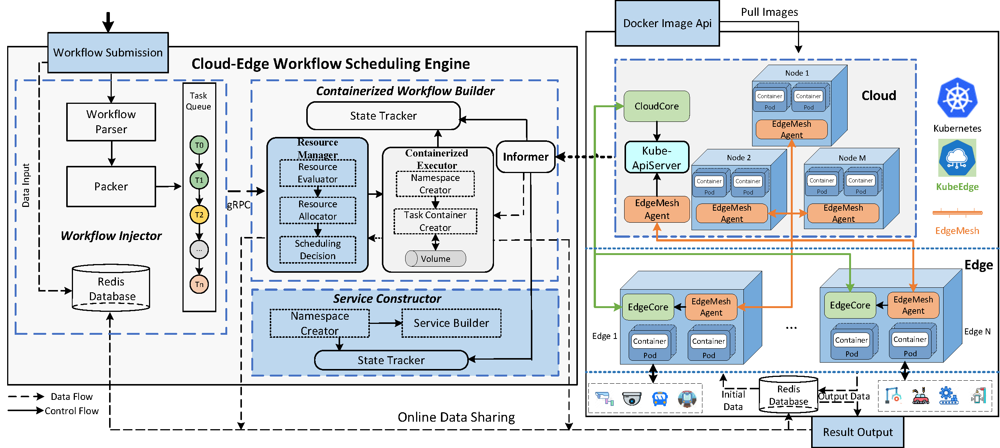
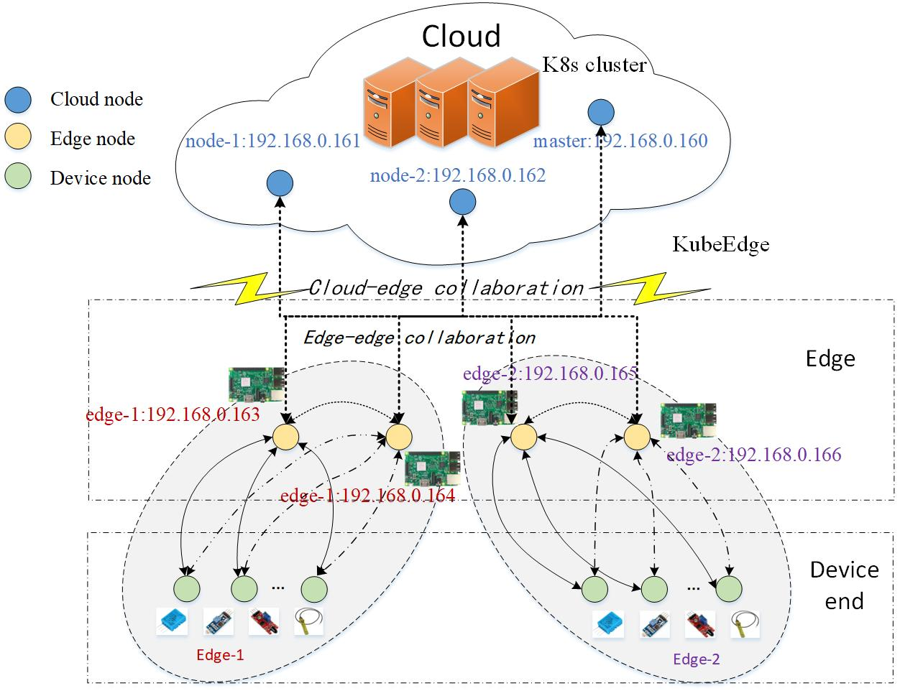

# KCES: A Workflow Containerization Scheduling Scheme Under Cloud-Edge Collaboration Framework.

## Background

As more IoT applications gradually move towards the cloud-edge collaborative mode, 
the containerized scheduling of workflows extends from the cloud to the edge. 
However, given the high delay of the communication network, loose coupling of 
structure, and resource heterogeneity between cloud and edge, 
workflow containerization scheduling in the cloud-edge scenarios faces the 
difficulty of resource coordination and application collaboration management.

To address these two issues, we propose a KubeEdge-Cloud-Edge-Scheduling scheme 
named `KCES`, a workflow containerization scheduling scheme for the KubeEdge 
cloud-edge framework. 
The `KCES` includes a cloud-edge workflow scheduling engine for KubeEdge and 
workflow scheduling strategies for task horizontal roaming and vertical offloading.
Considering the scheduling optimization of cloud-edge workflows, we propose a 
cloud-edge workflow scheduling model and cloud-edge node model and design a 
cloud-edge workflow scheduling engine to maximize cloud-edge resource utilization 
under the constraint of workflow task delay. A cloud-edge resource hybrid 
management technology is used to design the cloud-edge resource evaluation and 
resource allocation algorithm to achieve cloud-edge resource collaboration. 
Based on the idea of distributed functional roles and the hierarchical division 
of computing power, the horizontal roaming among the edges and vertical offloading 
strategies between the cloud and edges for workflow tasks are designed to realize 
the cloud-edge application collaboration.

## Access notification
Over the past two years, our team has been dedicated to developing a cloud 
workflow scheduling engine for the K8s cluster suitable for cloud or cloud-edge 
environments, aiming to provide a prototype software solution for workflow 
containerization scheduling in the cloud-edge environment. Up to now, a workflow 
containerization scheduling scheme for the KubeEdge cloud-edge framework has been 
proposed.

We welcome you to download, learn, and work together to maintain the `KECS` with 
us. If you use it for scientific research and engineering applications, please be sure 
to protect the copyright and indicate authors and source.

*The cloud-edge workflow scheduling engine realizes the management, scheduling, 
and containerized execution of workflow tasks across cloud-edge nodes. 
The engine provides a front-end interface for public or private clouds. 
The cloud-edge containerization scheduling of workflow tasks follows the 
priority dependency of tasks. Under the condition of satisfying the workflow SLAs, 
the resource evaluation algorithm, resource allocation algorithm, and scheduling 
decision are used to ensure the maximum utilization of cloud-edge resources. 
It provides a one-click deployment capability and automated software operation 
process for the KubeEdge framework.*

More information on original `Workflow Scheduling Engine` for cloud environment refers to our former work:

    1. Chenggang Shan, Yuanqing Xia, Yufeng Zhan, Jinhui Zhang. KubeAdaptor: A docking framework for workflow containerization on Kubernetes[J]. Future Generation Computer Systems, 2023, 148:584–599. 
       Github：https://github.com/CloudControlSystems/KubeAdaptor

More information on `resource allocation strategy` about `Worklfow Scheduling Engine` 
refers to our former work:

    2. Chenggang Shan, Chuge Wu, Yuanqing Xia, Zehua Guo, Danyang Liu, Jinhui Zhang. Adaptive Resource Allocation for Workflow Containerization on Kubernetes [J]. Journal of Systems Engineering and Electronics, 2023:34(3), 723-743.
       Github：https://github.com/CloudControlSystems/ResourceAllocation
       Github：https://github.com/CloudControlSystems/OOM-Test

More information on original `Containerized Worklflow Builder` refers to our former work:

    3. Chenggang Shan, Guan Wang, Yuanqing Xia, Yufeng Zhan, Jinhui Zhang. Containerized Workflow Builder for Kubernetes [C]. 2021 IEEE 23rd International Conference on High Performance Computing & Communications~(HPCC), Haikou, China, 2021: 685–692.
       Github：https://github.com/shanchenggang/cwb

## Resource description

### ./resourceScaling

This directory includes `baseline`, `experiments`, `resourceScalingMethod`, `resourceUsage`, `usage_deploy`, `WorkflowInjector-constant`, 
`WorkflowInjector-linear`, and `WorkflowInjector-pyramid` directories.

These directory files mainly correspond to the experimental evaluation and comparative analysis 
of the baseline and the `KCES` scheme.
It depicts the execution process of the `Cloud-Edge Workflow Scheduling Engine` 
running the IoT application workflow in the cloud-edge scenario, evaluates the 
performance of the `KCES` scheme, and verifies the effect of the task horizontal 
roaming and vertical offloading algorithms.

#### ./resourceScaling/baseline
This directory includes `TaskContainerBuilder` directories that contain the source 
codes of `Containerized Workflow Builder` within the `Cloud-Edge Workflow Scheduling Engine`. 
Herein, `Resource Allocator` follows the `First-Come-First-Serve` (`FCFS`) scheme, and 
this scheme depends on the adequacy of the remaining resources on a node in the 
cloud-edge cluster. If the residual resource amount of the node is sufficient, 
the resource allocation strategy is implemented. Otherwise, it needs to wait for 
other task Pods on the node to complete and release resources to meet the resource 
requirements requested by the current task.

#### ./resourceScaling/experiments
This directory includes experimental deployment files. The users can deploy the 
experiments of workflow injections through `deploy.sh` and clear this experiments 
through `clear.sh`. The `ipNode.txt` stores the whole cloud-edge cluster nodes' ip address and 
the `redisClear.sh` aims to clear the Redis data generated by this experiment. 
These automatic script files have the ability to capture the `Master IP` and obtain 
the other nodes' IP. When the experiment is done, you can get the `usage.txt`, 
`log.txt`, and `exp.txt` files through our designed automatic scripts `deploy.sh` 
and `clear.sh`. Our experimental environment consists of one `K8s` cluster and four edges nodes. 

The cloud consists of `K8s` clusters, and the edge includes four `Raspberry PI` edge 
nodes. We use `KubeEdge` to build the cloud-edge cluster, which integrates the cloud, 
edge, and device end containing sensors and other collecting devices. 
The edges and device end belong to distinct edge scenarios, such as `edge-1` and 
`edge-2`. The `Cloud-Edge Workflow Scheduling Engine` is deployed in the `K8s` cluster 
in the cloud, with continuous injection of workflows.

#### ./resourceScaling/resourceScalingMethod
This directory includes `TaskContainerBuilder` directories that contain the source
codes of `Containerized Workflow Builder` within the `Cloud-Edge Workflow Scheduling Engine`.
Herein, `Resource Allocator` follows the resource scaling strategy, aims to make 
each cloud or edge node host as many workflow tasks as possible, and maximizes the 
resource utilization of cloud-edge nodes without violating the task deadline.

#### ./resourceScaling/resourceUsage
This directory includes the source codes of the resource gathering module. 
You can build the Docker image by the `Dockerfile` file or pull the image of 
this module from the Docker Hub.

    docker pull shanchenggang/resource-usage:v1.0

#### ./resourceScaling/WorkflowInjector-constant
This directory includes the source codes of the workflow injection module under 
Constant Arrival Pattern. You can build Docker image by `Dockerfile` file or pull 
the image of this module from Docker Hub.

    docker pull shanchenggang/workflow-injector:v9.0

#### ./resourceScaling/WorkflowInjector-linear
This directory includes the source codes of the workflow injection module under 
Linear Arrival Pattern. You can build Docker image by `Dockerfile` file or pull the 
image of this module from Docker Hub.

    docker pull shanchenggang/workflow-injector:v9.1

#### ./resourceScaling/WorkflowInjector-pyramid
This directory includes the source codes of the workflow injection module under 
Pyramid Arrival Pattern. You can build Docker image by `Dockerfile` file or pull the 
image of this module from Docker Hub.

    docker pull shanchenggang/workflow-injector:v9.2

### ./roaming&offloading
This directory includes `deploy_test`, `taskHorizontalRoamming`, `taskVerticalOffloading`, 
 and `WorkflowInjector(ConstantArrivalPattern)` directories.

These directory files mainly correspond to the experimental evaluation of horizontal roaming and vertical offloading for 
workflow tasks in an edge scenario.
This section verifies the effect of the task horizontal roaming and vertical 
offloading algorithms of the `KCES` scheme.

#### ./roaming&offloading/deploy_test
Similar to the directory `./resourceScaling/experiments`, this directory includes experimental deployment files. 
Please refer to the above description of `./resourceScaling/experiments`.

#### ./roaming&offloading/taskHorizontalRoaming
This directory includes `TaskContainerBuilder` directories that contain the source
codes of `Containerized Workflow Builder` within the `Cloud-Edge Workflow Scheduling Engine`.
Herein, `Resource Allocator` follows the resource scaling strategy. 

Under the effect of the resource scaling strategy in `Resource Allocator`, 
with the help of the task horizontal roaming algorithm, the `Cloud-Edge workflow 
Scheduling Engine` can automatically capture the `OOMKilled` task Pod and 
transfer the load to other nodes in the same scenario to realize the resource 
reallocation of the `OOMKilled` task Pod and ensure the normal execution of 
the task Pod.

#### ./roaming&offloading/taskVerticalOffloading
This directory includes `TaskContainerBuilder` directories that contain the source
codes of `Containerized Workflow Builder` within the `Cloud-Edge Workflow Scheduling Engine`.
Herein, `Resource Allocator` follows the resource scaling strategy.

Under the effect of the resource scaling strategy in `Resource Allocator`,
with the help of the task vertical offloading algorithm, the `Cloud-Edge Workflow
Scheduling Engine` can automatically capture the `OOMKilled` task Pod and
transfer the load to other nodes in the same scenario to realize the resource
reallocation of the `OOMKilled` task Pod and ensure the normal execution of
the task Pod.

#### ./roaming&offloading/WorkflowInjector(ConstantArrivalPattern)
The task horizontal roaming and vertical offloading experiments use a constant 
arrival pattern to inject `b` workflows concurrently every `300` seconds by the 
`Workflow Injection module`, and a total of `N/b` batches were injected.

This directory includes the source codes of the workflow injection module under
Constant Arrival Pattern. You can build Docker image by `Dockerfile` file or pull
the image of this module from Docker Hub.

    docker pull shanchenggang/workflow-injector:v9.0

### Hardware and software Description 

#### Software Prerequisites

1. OS version: Ubuntu 20.4/CentOS Linux release 7.8
2. Kubernetes: v1.19.6
3. KubeEdge 1.9.1
4. Docker: 18.09.6.

#### Infrastructure specification

1. Intel(R) Core(TM), i7-1165G7@2.80GHz, Intel PRO/1000. (for cloud nodes)
2. Raspberry Pi4 Model B, Broadcom BCM2835, Cortex-A72@1.5GHz, 2.4GHz WiFi. (for edge nodes)
